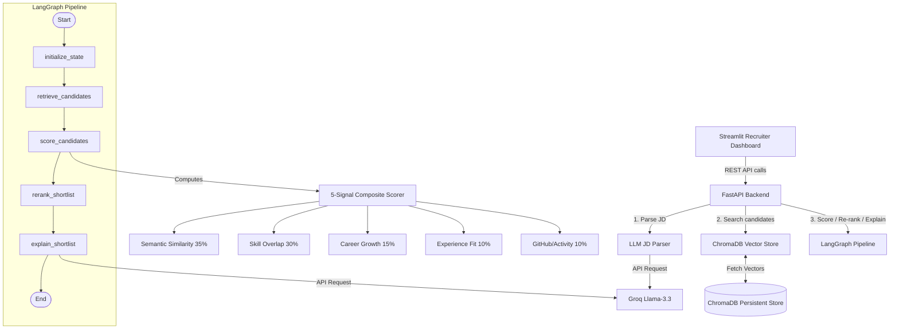

# Architecture of RecruitMind AI

This document provides a detailed technical overview of RecruitMind AI's system architecture, pipeline orchestration, scoring engine, data flows, and design decisions.

---

## 📌 High-Level Architecture Diagram

The system follows a decoupling of frontend (Streamlit), backend API (FastAPI), vector storage (ChromaDB), and an orchestrator graph (LangGraph) that manages the execution of the pipeline.

---

## 🧠 Core System Components

### 1. FastAPI REST Backend (`api/main.py`)
Provides high-performance, asynchronous REST endpoints for both candidate management and evaluation. 
- **Auto-Indexing Lifespan Manager**: On application startup, the server automatically checks if the ChromaDB vector database is populated. If empty, it loads, embedding-indexes, and saves the candidate pool from `data/candidates.json` into ChromaDB automatically.
- **Key Endpoints**:
  - `GET /health`: System wellness, vector database status, and LLM availability check.
  - `GET /candidates`: Paginated view of raw candidate profiles.
  - `POST /index`: On-demand re-indexing of the database.
  - `POST /rank`: Evaluates a raw Job Description text through the complete LangGraph matching pipeline.
  - `POST /explain`: Generates natural language justifications for candidate recommendations.

### 2. LangGraph Orchestrator (`pipeline/ranker.py`)
RecruitMind AI utilizes a stateful, deterministic graph to control the workflow of parsing, searching, scoring, diversity filtering, and explanation. The graph defines 6 distinct nodes:
1. `initialize_state`: Prepares the Graph State (e.g., job requirements, parameters).
2. `retrieve_candidates`: Invokes `pipeline/embedder.py` to get candidate IDs matching semantic similarity from ChromaDB.
3. `score_candidates`: Computes sub-scores and the composite score for all candidates.
4. `rerank_shortlist`: Re-orders the top candidates through a diversity filter, adjusting ranks if there's seniority over-representation.
5. `explain_shortlist`: Uses the Groq LLM (with offline heuristic fallback) to generate natural language recruiter explanations.
6. `compile`: Completes the graph execution and produces the final shortlist.

### 3. Multi-Signal Scoring Engine (`pipeline/scorer.py`)
Instead of simple keyword matching, candidate profiles are evaluated using 5 distinct signals:
- **Semantic Similarity (35%)**: Cosine distance of the candidate's summary/experience embeddings against the job description embedding.
- **Skill Match (30%)**: Direct overlap ratio of required and nice-to-have skills with case-insensitive normalization.
- **Career Growth (15%)**: Assesses trajectory, promotions, and tenure duration (penalizing job-hopping under 6 months).
- **Experience Fit (10%)**: Compares years of experience against the JD bounds, applying a linear penalty for under-experienced and a mild penalty for over-experienced.
- **Activity Signal (10%)**: Evaluates GitHub contributions, open-source PRs, and LeetCode activity (with a recency-based decay multiplier).

### 4. Vector Database & Embeddings (`pipeline/embedder.py`)
- Uses `sentence-transformers/all-MiniLM-L6-v2` to map candidates' resumes and job descriptions into a dense 384-dimensional vector space.
- Utilizes an offline, persistent ChromaDB container to retrieve the top semantic candidates during the retrieval step.

### 5. LLM Integrations
- **JD Parser (`pipeline/jd_parser.py`)**: Uses Groq `llama-3.3-70b-versatile` to convert free-form JDs into structured JSON (skills, seniority, min/max experience). Fallback parser handles offline execution without API keys.
- **Explainer (`pipeline/explainer.py`)**: Compiles all scores, signals, and gaps, formatting them into a prompt for the LLM to write a concise, highly-tailored evaluation note.
